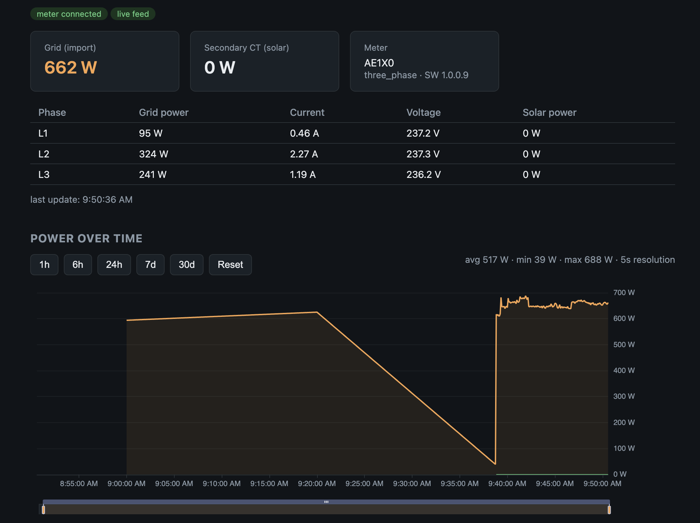

# h0me-p0wer

Dashboard for the **Anker SOLIX Smart Meter Gen 2 (AE1X0)** — live power
monitoring and historical energy visualization, built as a proof of concept.



## Features

- **Live data, no cloud**: 5-second power readings (grid total, per-phase
  power/current/voltage, secondary CT) pulled directly from the meter over
  local **Modbus TCP** — Anker's officially supported local interface
- **Cloud history**: daily/weekly/monthly/yearly energy data from the Anker EU
  cloud, using the reverse-engineered app login (ECDH P-256 + AES-256-CBC)
- **One unified chart** (Apache ECharts, stock-chart style):
  - pan / zoom / range-slider, span shortcuts (1h–30d)
  - resolution follows zoom — down to raw 5 s samples where local data exists
  - min/max **envelope** per bucket so spikes survive aggregation
  - cloud 20-min averages fill the past, interpolated into a continuous line;
    local data always wins where both exist
- **Overview dashboard** (second page): totals tiles (now/today/week/month/
  year kWh), day profile, and week/month/year kWh bar overviews — all from a
  single local aggregate endpoint
- **Local persistence** in SQLite (`node:sqlite`, no native deps): 5 s samples
  (48 h retention) + cached cloud history with startup backfill (30 days) and
  a 15-minute background sync that respects Anker's rate limits
- Failure-tolerant: live-only mode without credentials, cloud-only mode when
  the meter is unreachable — each panel degrades gracefully

## Architecture

```
                ┌─────────────┐   Modbus TCP :502 (5 s)   ┌──────────────┐
                │   Browser   │ ◄── WebSocket / REST ──── │  Node backend│
                │  (React +   │                           │  (Express)   │
                │   ECharts)  │                           │      │       │
                └─────────────┘                           │  SQLite DB   │
                                                          └──────┼───────┘
                              Anker EU cloud (REST, 15 min sync) ▲
```

## Setup

```sh
cp .env.example .env   # fill in ANKER_EMAIL / ANKER_PASSWORD, adjust METER_IP
```

Enable Modbus TCP on the meter: Anker app → Smart Meter Gen 2 → Settings →
Three-Party Control Settings → Modbus TCP. The app shows the meter's local IP.

## Run

Single port (production style — backend serves the built frontend):

```sh
npm run setup   # once: install all dependencies
npm start       # builds the frontend, serves everything on http://localhost:3001
```

Dev mode (hot reload, two processes on :3001 + :5173):

```sh
npm run dev
```

Auto-start on login (macOS launchd — adjust paths in the plist first):

```sh
cp scripts/com.h0mep0wer.server.plist ~/Library/LaunchAgents/
launchctl load ~/Library/LaunchAgents/com.h0mep0wer.server.plist
```

The Vite dev server proxies `/api` to the backend; the dashboard's WebSocket
connects directly to the backend port.

## Deploy (Docker, production)

Every merge to `main` publishes an image to
`ghcr.io/lucianhanga/h0me-p0wer:latest` (GitHub Actions → CI + Publish).

On the production server (only Docker needed):

```sh
# one-time setup
mkdir h0me-p0wer && cd h0me-p0wer
curl -O https://raw.githubusercontent.com/lucianhanga/h0me-p0wer/main/docker-compose.yml
curl -o .env https://raw.githubusercontent.com/lucianhanga/h0me-p0wer/main/.env.example
$EDITOR .env          # fill in credentials + METER_IP + TARIFF_EUR_PER_KWH
chmod 600 .env        # secrets stay only on this machine

# run / update
docker compose pull
docker compose up -d
```

The dashboard is then on `http://<server>:3001`. SQLite lives in the
`h0me-p0wer-data` volume and survives updates. The container restarts
automatically (`unless-stopped`).

### Operational notes

- **The meter accepts only ONE Modbus TCP connection** — never run two
  instances (container + local dev) against it at the same time.
- **Cloud rate limits**: Anker limits API calls and aggressively rate-limits
  *logins* (repeated fresh logins lock the account for 7 minutes). The
  backend therefore persists the auth token in `/data/.token-cache.json`
  (inside the volume) and backs off automatically after login failures —
  avoid restarting the container in a loop, and avoid running a second
  cloud-connected instance from the same public IP.
- **Graceful stop**: the server handles SIGTERM, so `docker stop` shuts down
  cleanly (Modbus released immediately).
- Healthcheck: `docker compose ps` shows health via `/api/live`; logs via
  `docker compose logs -f`.

## Notes

- The register map comes from Anker's official Home Assistant integration
  (input registers / FC04, big-endian, value = raw ÷ gain).
- Cloud endpoints are unofficial (reverse-engineered from the Android app),
  rate-limited (~10–12 req/min/endpoint/IP) and may change without notice.
- `.env`, `node_modules`, build output and the local database are git-ignored.
