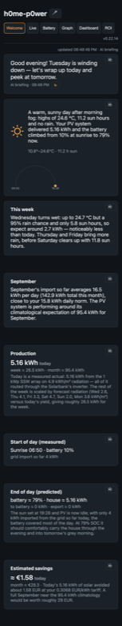
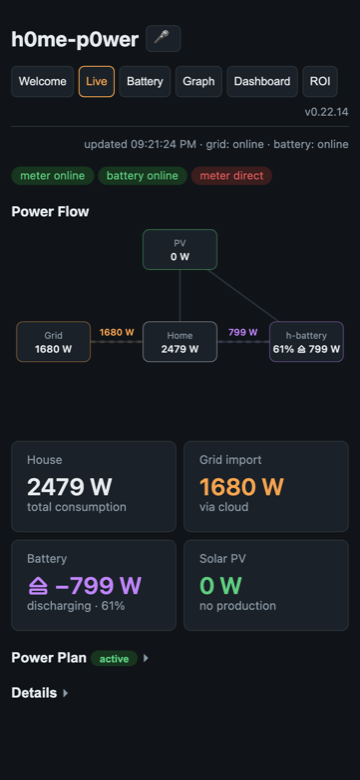
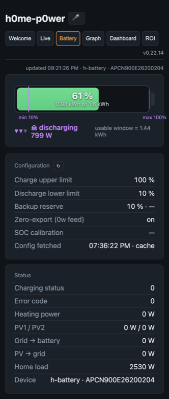
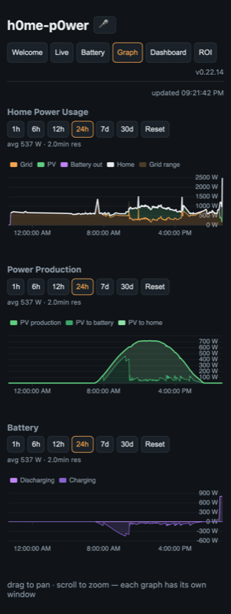
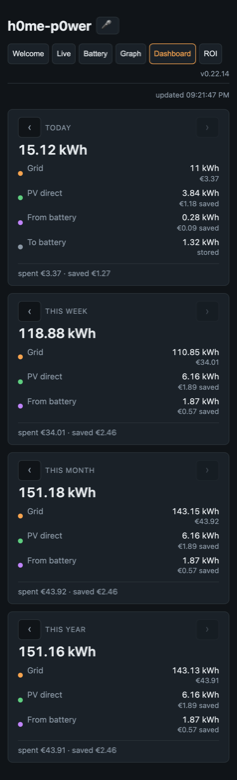
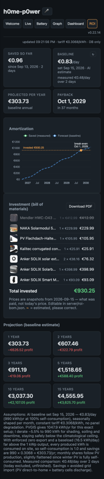

# h0me-p0wer

Home-energy dashboard **and controller** for the **Anker SOLIX** balcony
setup: Smart Meter Gen 2 (AE1X0, local Modbus TCP) + Solarbank 2 E1600 Plus
battery + 2×500 W PV — live monitoring, history, AI briefings, ROI tracking,
and its own PV-aware power plan that drives the battery's output preset.

| Welcome (AI briefing) | Live (power flow) | Strategy (battery + power plan) |
|---|---|---|
|  |  |  |

| Graph (history) | Dashboard (consumption by source) | ROI (payback) |
|---|---|---|
|  |  |  |

## The six tabs

- **Welcome** — an AI briefing (any OpenAI-compatible endpoint): today's
  weather with a sunrise→sunset arc, week/month sun outlook, estimated PV
  production for your system, measured start-of-day vs. predicted end-of-day
  battery/house state, savings in € at your tariff, and yesterday's measured
  summary — ordered present → recent past → broader trend → bottom line.
  Facts are gathered deterministically (Nominatim + Open-Meteo + PVGIS — all
  free and keyless — plus your local history); ONE structured AI call per
  scheduled slot (6:00–22:00 every 2 h), deterministic fallback offline.
  Per-tile text-to-speech + a voice Q&A button (STT → AI → spoken answer).
- **Live** — animated power-flow diagram (PV / grid / home / battery with the
  correct Anker split: PV→home is inverter pass-through, never
  double-counted), main tiles (house, grid, battery with charge/discharge
  symbols, PV incl. per-string PV1/PV2), per-phase details, and the
  **Power Plan** status card (see below).
- **Strategy** — choose how the power plan prioritizes PV/battery/grid (see
  below), plus the battery gauge and every battery parameter (limits,
  backup reserve, zero-export switch, per-string PV, temperature, error
  codes — collapsed behind a details toggle; device config cached 1 h to
  respect Anker rate limits).
- **Graph** — three focused charts (Home Power Usage / Power Production /
  Battery), each with its own span buttons (1h/6h/12h/24h/7d/30d), pan/zoom,
  resolution that follows zoom (raw 1 s samples where local data exists,
  cloud 20-min anchors + interpolation for the past), and live updates.
- **Dashboard** — consumption by source for today/week/month/year: house
  total split into grid / PV-direct / from-battery (cells only — no double
  booking), plus PV→battery stored and total PV produced; € spent vs saved
  per source; ‹ › period navigation into the past; flip a tile for per-day
  stacked bars.
- **ROI** — bill of materials with snapshotted purchase prices (clickable to
  the source listing, thumbnails, PDF download), amortization chart with
  measured savings vs. a seasonally-shaped forecast, and payback/projections
  (1–15 y) computed from a **fixed AI-estimated baseline** (PVGIS climatology
  × your tariff — set once, recomputed only on demand) instead of noisy
  short-term averages.

## Power Plan (the controller)

The app can steer the battery instead of relying on the static Anker-app
schedule. Pick a **strategy** and a **discharge trigger** on the Strategy
tab:

- **House priority** (default) — the device runs Anker's **native
  Self-Consumption Mode** (the same mode the Anker app offers): it follows
  the smart meter locally, sub-second, zero export, covering the house from
  PV + battery down to the discharge cutoff configured in the Anker app.
  This app just switches the mode on and monitors.
- **Battery priority** — PV charges the battery first; the house draws from
  the grid meanwhile. Once the battery is full, PV alone is ramped toward
  the house's demand (leaving a small `GRID_TARGET_W` margin, default
  25 W) — the battery is never discharged under this strategy, so a full
  battery stays full. Better suited if you get frequent grid outages and
  want more energy in reserve.
- **Anker app** — this app writes nothing at all; the device runs whatever
  you configured in the Anker mobile app (including Anker's own AI mode),
  while monitoring stays active.
- **Discharge trigger**: `auto` (the strategy above decides) or `manual` — a
  persisted Discharge/Don't-discharge toggle that **overrides whichever
  strategy is selected**, for testing or a deliberate manual call. Manual
  discharge uses the preset path: cover demand minus `GRID_TARGET_W`, down
  to the Anker-app floor + a safety margin (`DISCHARGE_TOLERANCE_PCT`,
  default 3 points).

In preset mode (Battery priority / manual), the app drives the battery's
output preset via the Anker weekly schedule (write path verified): writes
only on meaningful changes (≥50 W, ≥30 s apart, up-steps held 90 s), and
an export watchdog cuts the preset the moment the meter sees real export.
Enable (Live tab) saves the existing Anker schedule; disable restores it
byte-for-byte.

Per instance (state file next to the DB) — run it on exactly ONE server.

## Architecture

```
                ┌─────────────┐   Modbus TCP :502 (1 s)   ┌──────────────┐
                │   Browser   │ ◄── WebSocket push / REST │  Node backend│
                │  (React +   │     (1-3 s live updates)  │  (Express)   │
                │   ECharts)  │                           │  SQLite DB   │
                └─────────────┘                           └──────┬───────┘
                              Anker EU cloud: REST (3-10 s battery sync,
                              15 min history) + MQTT telemetry push ▲
```

Local 1 s Modbus samples (48 h retention) + cached cloud history + battery
snapshots in SQLite (`node:sqlite`, no native deps); background-first: the
server always pulls and pushes live values over WebSocket, clients just
read.

## Setup

```sh
cp .env.example .env   # ANKER_EMAIL / ANKER_PASSWORD, METER_IP,
                       # TARIFF_EUR_PER_KWH, HOME_ADDRESS, PV_*, AI_*
```

Enable Modbus TCP on the meter: Anker app → Smart Meter Gen 2 → Settings →
Three-Party Control Settings → Modbus TCP. The app shows the meter's local IP.

## Run

```sh
npm run setup   # once: install all dependencies
npm start       # builds the frontend, serves everything on http://localhost:3001
npm run dev     # dev mode: backend :3001 + Vite :5173 (hot reload)
```

Auto-start on login (macOS launchd — adjust paths in the plist first):

```sh
cp scripts/com.h0mep0wer.server.plist ~/Library/LaunchAgents/
launchctl load ~/Library/LaunchAgents/com.h0mep0wer.server.plist
```

## Deploy (Docker, production)

Builds locally from source on the production host — no registry involved.

```sh
# one-time setup
git clone https://github.com/lucianhanga/h0me-p0wer.git && cd h0me-p0wer
cp .env.example .env
$EDITOR .env          # credentials + METER_IP + TARIFF_EUR_PER_KWH + AI_*
chmod 600 .env        # secrets stay only on this machine

# run / update
git pull --ff-only
docker compose up -d --build
```

The dashboard is then on `http://<server>:3001`. SQLite + the power-plan
state live in the `h0me-p0wer-data` volume and survive updates.

> ⚠️ **No authentication — trusted LAN only.** Every endpoint is open to
> any device that can reach port 3001, and some of them have real
> consequences: `POST /api/power-plan/*` writes to the physical battery
> schedule, `/api/cloud/*` proxies your Anker account (and burns its rate
> budget), the welcome/ROI refresh endpoints spend AI credits. Run this
> only on a network you trust, and **never port-forward 3001** to the
> internet.

### Operational notes

- **The meter accepts only ONE Modbus TCP connection** — never run two
  instances against it at the same time.
- **The power plan is per-instance too** — enable it on exactly one server.
- **Cloud rate limits**: Anker aggressively rate-limits *logins* (repeated
  fresh logins lock the account for 7 minutes). The backend persists the auth
  token in `/data/.token-cache.json` and backs off automatically — avoid
  restart loops and second cloud-connected instances from the same public IP.
- **Graceful stop**: SIGTERM/SIGINT handled (Modbus released immediately).

## Notes

- The register map comes from Anker's official Home Assistant integration
  (input registers / FC04, big-endian, value = raw ÷ gain).
- Cloud endpoints are unofficial (reverse-engineered from the Android app),
  rate-limited (~10–12 req/min/endpoint/IP) and may change without notice.
- `.env`, `node_modules`, build output and the local database are git-ignored.
